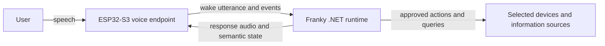

# Architecture Overview

Status: **Accepted direction; evolving implementation**

## System boundary

The ESP32 is Franky's room-facing voice endpoint and the computer is its compute host. Both sides run software owned by this project. [ADR-0001](../adr/0001-runtime-and-home-automation-boundary.md) records the standalone product boundary, and [ADR-0003](../adr/0003-use-dotnet-modular-monolith.md) records the selected computer runtime.

USB serial currently proves this boundary during development. The target room
deployment replaces that development link with authenticated Wi-Fi/WebSocket
transport without moving speech recognition or command execution onto the board.

## Device responsibilities

- Capture microphone audio.
- Play response audio.
- Detect the wake phrase locally and end the utterance after trailing silence.
- Present system state through the LED ring and speaker cues.
- Report input events and connection health.
- Avoid storing durable credentials beyond what is required for authenticated connectivity.

## Computer responsibilities

- Receive or coordinate the speech stream.
- Perform or delegate speech-to-text and text-to-speech.
- Interpret the request within the approved capability boundary.
- Authenticate to selected devices, services, or local integrations.
- Validate and execute actions.
- Produce structured, privacy-aware diagnostics.

## Selected custom runtime shape

Use one .NET 10 computer application with explicit internal boundaries for device sessions, speech adapters, conversation, capabilities, and diagnostics. Model and speech providers remain replaceable. Split a boundary into another process only when measurement or a native dependency provides a concrete reason.

The first speech-to-text provider runs Whisper locally through Whisper.net. During the USB development phase, the same .NET process serves the Franky control board and its loopback-only transcription endpoint. The ESP32 uses its existing ESP-SR Audio Front End to end wake utterances after trailing silence. [ADR-0007](../adr/0007-use-local-whisper-for-speech-to-text.md) records this decision.

## Target Wi-Fi communication shape

Use a persistent WebSocket connection initiated by the ESP32. Carry small JSON control messages and binary mono PCM audio frames over the same authenticated session. [ADR-0004](../adr/0004-use-websocket-json-and-pcm.md) records the accepted transport baseline. The wake-driven USB prototype now supplies evidence for the utterance lifecycle, but its exact network messages still need to be incorporated into the [draft device protocol](device-protocol-v1.md) before Wi-Fi implementation.

## Cross-cutting requirements

- Secrets must remain outside Git.
- Every externally visible action must have a traceable request outcome.
- The system must distinguish a completed action from a generated conversational response.
- Network or service failure must degrade safely.
- Any cloud or third-party model dependency must be deliberate and documented.
