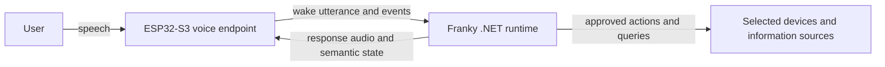

# Architecture Overview

Status: **Accepted direction; evolving implementation**

## System boundary

The ESP32 is Franky's room-facing voice endpoint and the computer is its compute host. Both sides run software owned by this project. [ADR-0001](../adr/0001-runtime-and-home-automation-boundary.md) records the standalone product boundary, and [ADR-0003](../adr/0003-use-dotnet-modular-monolith.md) records the selected computer runtime.

USB serial currently proves this boundary during development. The target room
deployment replaces that development link with authenticated Wi-Fi/WebSocket
transport without moving speech recognition or command execution onto the board.

## Device responsibilities

- Capture microphone audio.
- Play response audio.
- Detect the wake phrase locally and end the utterance after trailing silence.
- Present system state through the LED ring and speaker cues.
- Report input events and connection health.
- Avoid storing durable credentials beyond what is required for authenticated connectivity.

## Computer responsibilities

- Receive or coordinate the speech stream.
- Perform or delegate speech-to-text and text-to-speech.
- Interpret the request within the approved capability boundary.
- Authenticate to selected devices, services, or local integrations.
- Validate and execute actions.
- Produce structured, privacy-aware diagnostics.
- Persist wake-training audio only inside the separately approved, deliberate
  record/review/keep workflow; ordinary wake audio remains ephemeral.

## Selected custom runtime shape

Use one .NET 10 computer application with explicit internal boundaries for device sessions, speech adapters, conversation, capabilities, and diagnostics. Model and speech providers remain replaceable. Split a boundary into another process only when measurement or a native dependency provides a concrete reason.

The first speech-to-text provider runs Whisper locally through Whisper.net.
The runtime now also has a provider-neutral speech-synthesis boundary that
accepts bounded text, produces 16 kHz mono PCM for the current board path,
rejects overlapping work and invalid output, supports cooperative cancellation,
and emits metadata-only diagnostics. A production TTS engine and voice remain
unselected, and the boundary is not yet connected to device playback.
During the USB development phase, the same .NET process serves the Franky
control board, its loopback-only transcription endpoint, and an assistant-turn
endpoint that reuses the existing conversation session and allowlisted tool
executor. Local Ollama with `qwen3.5:4b` is the current conversation provider;
it keeps message history in memory. The OpenAI Responses adapter remains
selectable for later cloud use. Provider-neutral tool definitions are mapped to
each API without changing the fixed executor. A composite executor routes exact
tool names to either read-only host commands or fixed device actions. For the
first device action, a narrow local matcher routes common “How is it going?”
variants before the conversation model. The browser translates
`device.sfx.frankys_suuuper` to one allowlisted USB command and waits for
`SFX_DONE`; intent selection is not treated as device completion. Action outcomes return to the UI separately from
assistant text. The ESP32 retains
its ESP-SR Audio Front End for microphone processing and trailing-silence
endpointing, and runs the custom “Yo Franky” streaming model through TensorFlow
Lite Micro. [ADR-0007](../adr/0007-use-local-whisper-for-speech-to-text.md)
records the transcription choice and
[ADR-0008](../adr/0008-use-custom-microwakeword-model-for-yo-franky.md)
records the wake-model choice.
[ADR-0009](../adr/0009-use-local-ollama-for-current-conversation-provider.md)
records the local conversation-provider choice.

## Passive presence display boundary

Franky Presence is a separate, passive browser surface for the latest
transcript, reply, and trusted lifecycle or capability activity. The control
board service serves it at `/presence/`. In the current USB architecture, the
open control-board tab owns the complete device and wake lifecycle and publishes
ephemeral version-1 display events over a same-origin `BroadcastChannel`. The
presence page goes offline when those snapshots stop. A separate harness keeps
the deterministic mock states out of the passive page.

The current channel is an interim fit for the browser-owned USB path, not an
architecture decision for Wi-Fi. The eventual display feed belongs on the
runtime side after it owns authoritative device and session state. The likely
delivery is a one-way Server-Sent Events route, but that transport remains
provisional. The surface stays ephemeral and read-only: no POST routes, serial
access, commands, retries, settings, tool execution, model prompts, or
conversation history. The [provisional presence display event](presence-display-event.md)
defines the implemented semantics without approving the future transport.

## Target Wi-Fi communication shape

Use a persistent WebSocket connection initiated by the ESP32. Carry small JSON control messages and binary mono PCM audio frames over the same authenticated session. [ADR-0004](../adr/0004-use-websocket-json-and-pcm.md) records the accepted transport baseline. The wake-driven USB prototype now supplies evidence for the utterance lifecycle, but its exact network messages still need to be incorporated into the [draft device protocol](device-protocol-v1.md) before Wi-Fi implementation.

## Cross-cutting requirements

- Secrets must remain outside Git.
- Every externally visible action must have a traceable request outcome.
- The system must distinguish a completed action from a generated conversational response.
- Network or service failure must degrade safely.
- Any cloud or third-party model dependency must be deliberate and documented.
